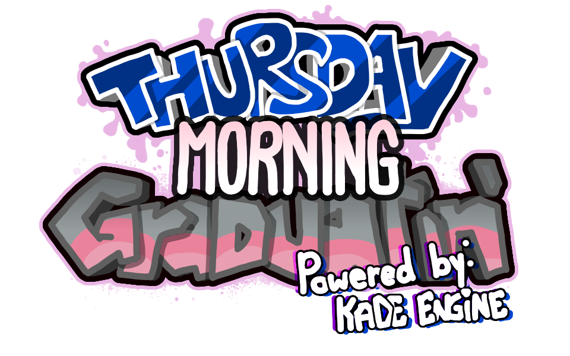

# Thursday Morning Graduatin'
**Thursday Morning Graduatin'** is a mod for Friday Night Funkin' that was created by [DreamedWave](https://github.com/DreamedWave) initially as a joke making fun of her scuffed graduation, but eventually evolved into a bigger project featuring many original tracks, new mechanics, a mostly new cast of characters, and a fully realised original story *(that is very much **NOT** connected to the story of Friday Night Funkin')*. It is built from the 1.6 version of Kade Engine, which was *HEAVILY* modified to add some improvements and remove bloat..

**REMEMBER**: This is a **mod** and is not associated with KadeDev or The Funkin' Crew. This was just created *PURELY* for fun by someone who was willing to dedicate 3 years of her life to a shitpost!!

	# Previews ([skip](#features))
	
	
	
	
	
	
	
	
	
	
	
	
	
	
	
	
	

# What You Can Expect:
 - **6 or so playable 'Weeks' (which are called 'Parts' in this mod)**
      - All containing 3 or more songs, each fully charted in all difficulties (Easy, Normal, and Hard)!
 - **Custom game mechanics**
      - Some 'Weeks' change up the formula a little bit, and adds a few new mechanics that builds upon Friday Night Funkin's gameplay without jeopardizing it!
 - *[to be added]* **An *actual* Tutorial Level**
      - That teaches any new players how to play without 100 or so lines of text!
 - **More unlockable Freeplay Songs**
      - Aside from all the songs within every 'Week', there will be more songs available for you to find and unlock within Freeplay!
 - **Adaptive Music**
      - Most to playable story mode songs change and react to how well you're doing!
      - For example: some tracks' instrumentals become more suspenseful when your health reaches critical levels.
 - *[to be added]* **Custom scoring and ranking system**
      - To keep the fun and casual aspect, this mod implements it's own take on a scoring and ranking system, mainly inspired by the system implemented in current day FNF!
      - Accuracy is now only an internal value, with it being only used to calculate gameplay-related events. Instead, your song clear percentage is determined by your note ratings!
      - Your song clear percentage then determines a Letter Ranking (such as F, D, C A, etc.) - inspired by Pizza Tower!
      - This makes it so that 100%ing a song is now ACTUALLY plausible, without requiring you to be a robot with complete accuracy!
      - Full Comboing a song isn't in vein though, as *something cool will happen when you sucessfully do so! Guess you'll have to wait and see~ >:3*
 - **Quality of Life additions**
      - Note Hit Sounds! (for both normal and hold notes - akin to that of osu's)
      - A visual and auditory cue for when you break a combo! (to avoid beating a level thinking you Full Combo'd it, only to see that you missed 1 note somewhere... yeowch)
      - Night Mode and Photosensitive Mode!
 - **And many more!**
      - Removed unecessary features like Replays and LUA implementation, as it really isn't gonna be used by me and only gave me more things to worry about.
      - Improved some backend stuff such as improving the look of the camera shake, adding a *stop();* function to *FlxSoundGroups*, and being able to choose what *FlxCamera* the transition takes place in!.
      - Honestly like I will probably list all the features here at one point but I literally need to write a research paper dawg I- ADMJSOVGJDBSFB
  

# Credits:
### Friday Night Funkin' (For being the og GOAT!!!)
 **Friday Night Funkin'** is a rhythm game originally made for Ludum Dare 47 "Stuck In a Loop".
 
Links: **[itch.io page](https://ninja-muffin24.itch.io/funkin) ⋅ [Newgrounds](https://www.newgrounds.com/portal/view/770371) ⋅ [source code on GitHub](https://github.com/ninjamuffin99/Funkin)**
 - [ninjamuffin99](https://twitter.com/ninja_muffin99) - Programming
 - [PhantomArcade3K](https://twitter.com/phantomarcade3k) and [Evilsk8r](https://twitter.com/evilsk8r) - Art
 - [Kawai Sprite](https://twitter.com/kawaisprite) - Music
 This game was made with love to Newgrounds and its community. Extra love to Tom Fulp. -Cameron
  

### FNF: Kade Engine (For the starting foundations of this mod)
 **Kade Engine** was a modification for an older build of Friday Night Funkin' created by KadeDev. Originally used for the VS Whitty mod.
 
 Links: **[source code on GitHub](https://github.com/kadedev/Kade-Engine)**
 - [KadeDeveloper](https://twitter.com/KadeDeveloper) - Maintainer and lead programmer
 - [(All contributors to this project)](https://github.com/KadeDev/Kade-Engine/graphs/contributors)
  

### FNF: Psych Engine (For code references)
 *(Specifically: Asset Loading/Paths.hx, MusicBeatState.hx, Framerate-bound FlxMath.lerp, Sustain Note fixes, Particle Emitters, and Input System!)*
 **Psych Engine** is a modification of Friday Night Funkin' lead by ShadowMario. Originally used for the Mind Games mod.

 Links: **[source code on GitHub](https://github.com/ShadowMario/FNF-PsychEngine)**
 - [ShadowMario](https://twitter.com/shadow_mario_)
 - [Riveren](https://twitter.com/riverennn)
  

### FNF: Indie Cross (For code references)
 *(Specifically: LoadingState.hx, VideoState.hx, CrashHandler code, and some Shader Stuff!)*
 **Indie Cross** is a massive community collaboration lead by BrightFyre, featuring 3 weeks and many more songs dedicated to indie games Cuphead, Undertale, and Bendy and the Ink Machine.

 Links: **[source code on GitHub](https://github.com/brightfyregit/Indie-Cross-Public)**
 - [BrightFyre](https://linktr.ee/BrightFyre)
 - [(All contributors to this project)](https://github.com/brightfyregit/Indie-Cross-Public/blob/master/source/CreditsMenu.hx)
  

### Special Thanks:
 **Huge Modding Help**
   - TheZoroForce240 for the [Note Type Guide!](https://drive.google.com/file/d/1YcG1TphzhbHgadgezhZQeUW65pPNtirG/view)
   - BrightFyre for the early Kade Engine 1.6 Modding tutorials
   - bbpanzu for more modding tutorials
   - PolybiusProxy for the initial videosprite code used for testing

**Musical Inspirations**
   - [C418 (Daniel Rosenfeld)](https://c418.bandcamp.com/)
   - [Toby Fox](https://tobyfox.bandcamp.com/)
   - [Kawai Sprite](https://drugpop.bandcamp.com/)
   - [Femtanyl (Noelle)](https://www.youtube.com/@Femtanyl03)
   - [Torr](https://linktr.ee/torrmusic)
   - [Lena Raine](https://www.notion.so/RADICAL-DREAMLAND-62b6665ca4ce4c658b7f036e930551a3?pvs=4#83c26288234247d8bc360080d9d47bc8)
   - [Tanger (Vi)](https://www.youtube.com/@Tangermusic)
   - [Laura Shigihara](https://www.youtube.com/@supershigi)

 **Game Design Inspirations**
   - [Decked Out 2](https://www.youtube.com/watch?v=aoVVCwx6k1w) (by [TangoTek](https://www.youtube.com/@TangoTekLP))
   - [Pizza Tower](https://store.steampowered.com/app/2231450/Pizza_Tower/) (by [Tour De Pizza](https://twitter.com/PizzaTowergame))
   - [Lethal Company](https://store.steampowered.com/app/1966720/Lethal_Company/) and [The Upturned](https://store.steampowered.com/app/1717770/The_Upturned/) (by [Zeekerss](https://twitter.com/ZeekerssRBLX))
   - [Pressure](https://www.roblox.com/games/12411473842/Pressure) (by [YourFriendZeal](https://twitter.com/YourFriendZeal), [zerum](https://twitter.com/zerkichi), [SearingCircuits](https://twitter.com/SearingCircuits), and [NoLongerNull](https://twitter.com/NoLongerNull))
   - [Doors](https://www.roblox.com/games/6516141723/DOORS) (by [LSPLASH](https://x.com/LightningSplash) and [Redibles](https://x.com/RediblesQW))
   - [Celeste](https://store.steampowered.com/app/504230/Celeste/) (by [Maddy Thorson](https://www.mattmakesgames.com/) & [Her Team](https://www.exok.com/))

 **Artstyle Inspirations**
   - [Temmie Chang](https://www.youtube.com/Temmiechang)
   - [PhantomArcade](https://phantomarcade.newgrounds.com/)

 **And Lastly (but not the least)**
   - To a few of my friends that initially gave me the idea to make this into a full-blown thing
   - To all the friends who stuck around with me and this project throughout the years
   - To my classmates and acquaintances that were interested in the project - atleast even just for a brief moment
   - And to you who is reading this right now!

**Big thanks to you all! This project would not have been possible if it weren't for all of you!**
