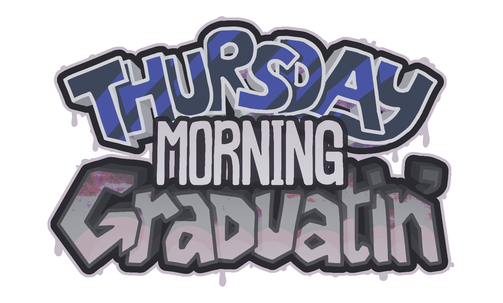

# Thursday Morning Graduatin' (Cancelled)
**Thursday Morning Graduatin'** was a mod for Friday Night Funkin' that was created by [me](https://en.pronouns.page/@AmieeWuzHere) initially as a joke making fun of my scuffed graduation, but eventually evolved into a bigger project that ended up being too ambitious to be worked on. It was built from the 1.6 version of Kade Engine that was heavily modified.

**REMEMBER**: This is a **mod** and is not associated with KadeDev or The Funkin' Crew. This was just created *PURELY* for fun by someone who was willing to dedicate 3 years of her life to a shitpost! Also like, I'm NOT a coder, so I'm warning *YOU* in advance, the source code may make any coders reading it weep, scream, and cry.

To find out how to be able to build this mod, click [this](https://github.com/DreamedWave/Thursday-Morning-Graduatin/blob/main/BUILDING-GUIDE.md)!

# Current Freatures:
 - **Adaptive Music**
      - Most of the playable story mode songs change and react to how well you're doing!
      - For example: some tracks' instrumentals become more suspenseful the more your health lowers.
 - **Quality of Life additions**
      - Note Hit Sounds! (for both normal and hold notes - akin to that of osu's)
      - A visual and auditory cue for when you break a combo! (to avoid beating a level thinking you Full Combo'd it, only to see that you missed 1 note somewhere... yeowch)
      - Night Mode and Photosensitive Mode!
 - **A few Backend Fixins/Rewrites**
  

# Prevously Planned Features:
 - *[tba]* **6 or so playable 'Weeks' (which are called 'Parts' in this mod)**
 - *[tba]* **Custom game mechanics**
 - *[tba]* **An *actual* Tutorial Level**
 - *[tba]* **Unlockable Freeplay Songs**
 - *[tba]* **Custom scoring and ranking system**
  

# Credits:
### Friday Night Funkin' (For being the og GOAT!!!)
 **Friday Night Funkin'** is a rhythm game originally made for Ludum Dare 47 "Stuck In a Loop".
 
Links: **[itch.io page](https://ninja-muffin24.itch.io/funkin) ⋅ [Newgrounds](https://www.newgrounds.com/portal/view/770371) ⋅ [source code on GitHub](https://github.com/ninjamuffin99/Funkin)**
 - [ninjamuffin99](https://twitter.com/ninja_muffin99) - Programming
 - [PhantomArcade3K](https://twitter.com/phantomarcade3k) and [Evilsk8r](https://twitter.com/evilsk8r) - Art
 - [Kawai Sprite](https://twitter.com/kawaisprite) - Music
 This game was made with love to Newgrounds and its community. Extra love to Tom Fulp. -Cameron
  

### FNF: Kade Engine (For the starting foundations of this mod)
 **Kade Engine** was a modification for an older build of Friday Night Funkin' created by KadeDev. Originally used for the VS Whitty mod.
 
 Links: **[source code on GitHub](https://github.com/kadedev/Kade-Engine)**
 - [KadeDeveloper](https://twitter.com/KadeDeveloper) - Maintainer and lead programmer
 - [(All Kade Engine contributors)](https://github.com/KadeDev/Kade-Engine/graphs/contributors)
  

### FNF: Psych Engine (For code references)
 *(Specifically: Asset Loading/Paths.hx, MusicBeatState.hx, Framerate-bound FlxMath.lerp, Sustain Note fixes, Particle Emitters, and Input System!)*
 **Psych Engine** is a modification of Friday Night Funkin' lead by ShadowMario. Originally used for the Mind Games mod.

 Links: **[source code on GitHub](https://github.com/ShadowMario/FNF-PsychEngine)**
 - [ShadowMario](https://twitter.com/shadow_mario_)
 - [Riveren](https://twitter.com/riverennn)
  

### FNF: Indie Cross (For code references)
 *(Specifically: LoadingState.hx, VideoState.hx, CrashHandler code, and some Shader Stuff!)*
 **Indie Cross** is a massive community collaboration lead by BrightFyre, featuring 3 weeks and many more songs dedicated to indie games such as Cuphead, Undertale, and Bendy and the Ink Machine.

 Links: **[source code on GitHub](https://github.com/brightfyregit/Indie-Cross-Public)**
 - [BrightFyre](https://linktr.ee/BrightFyre)
 - [(All Indie Cross contributors)](https://github.com/brightfyregit/Indie-Cross-Public/blob/master/source/CreditsMenu.hx)
  

### Special Thanks:
 **Huge Modding Help**
   - [TheZoroForce240](https://github.com/TheZoroForce240) for the [Note Type Guide](https://drive.google.com/file/d/1YcG1TphzhbHgadgezhZQeUW65pPNtirG/view) and the [OpenAL FlxSound implementation!](https://github.com/TheZoroForce240/FlxSoundFilters)
   - [BrightFyre](https://www.youtube.com/channel/UCvbZKyPNpKGri4uKGsZSw6w) for the early Kade Engine 1.6 Modding tutorials
   - [bbpanzu](https://www.youtube.com/channel/UCkdhotVDNwu7ZCoe-99AJRQ) for more modding tutorials
   - [PolybiusProxy](https://github.com/polybiusproxy) for the initial videoplayer code used for testing
    

**Musical Inspirations**
   - [C418 (Daniel Rosenfeld)](https://c418.bandcamp.com/)
   - [Toby Fox](https://tobyfox.bandcamp.com/)
   - [Kawai Sprite](https://drugpop.bandcamp.com/)
   - [Femtanyl (Noelle)](https://www.youtube.com/@Femtanyl03)
   - [Torr](https://linktr.ee/torrmusic)
   - [Lena Raine](https://www.notion.so/RADICAL-DREAMLAND-62b6665ca4ce4c658b7f036e930551a3?pvs=4#83c26288234247d8bc360080d9d47bc8)
   - [Tanger (Vi)](https://www.youtube.com/@Tangermusic)
   - [Laura Shigihara](https://www.youtube.com/@supershigi)
  

 **Game Design Inspirations**
   - [Decked Out 2](https://www.youtube.com/watch?v=aoVVCwx6k1w) (by [TangoTek](https://www.youtube.com/@TangoTekLP))
   - [Pizza Tower](https://store.steampowered.com/app/2231450/Pizza_Tower/) (by [Tour De Pizza](https://twitter.com/PizzaTowergame))
   - [Lethal Company](https://store.steampowered.com/app/1966720/Lethal_Company/) and [The Upturned](https://store.steampowered.com/app/1717770/The_Upturned/) (by [Zeekerss](https://twitter.com/ZeekerssRBLX))
   - [Pressure](https://www.roblox.com/games/12411473842/Pressure) (by [YourFriendZeal](https://twitter.com/YourFriendZeal), [zerum](https://twitter.com/zerkichi), [SearingCircuits](https://twitter.com/SearingCircuits), and [NoLongerNull](https://twitter.com/NoLongerNull))
   - [Doors](https://www.roblox.com/games/6516141723/DOORS) (by [LSPLASH](https://x.com/LightningSplash) and [Redibles](https://x.com/RediblesQW))
   - [Celeste](https://store.steampowered.com/app/504230/Celeste/) (by [Maddy Thorson](https://www.mattmakesgames.com/) & [Her Team](https://www.exok.com/))
  

 **Art Inspirations**
   - [Temmie Chang](https://www.youtube.com/Temmiechang)
   - [PhantomArcade](https://phantomarcade.newgrounds.com/)
   - [Issbrokie/Shteppi](https://www.instagram.com/shteppi/)
   - Femtanyl
   - Tour De Pizza
   - SearingCircuits
  

 **And Lastly (but not the least)**
   - To my 'Eldritch' friends that initially gave me this idea and pushed me to make an FNF Mod
   - To my 'BEPIS' friends for supporting me throughout these years of development and just being overall really cool people
   - To my 'Joki Joki' friends, and any classmates/acquaintances that were interested in the project - atleast even just for a brief moment
   - And to you who is reading this right now!

**A BIG thanks to you all! This project would not have been possible if it weren't for all of you!**
